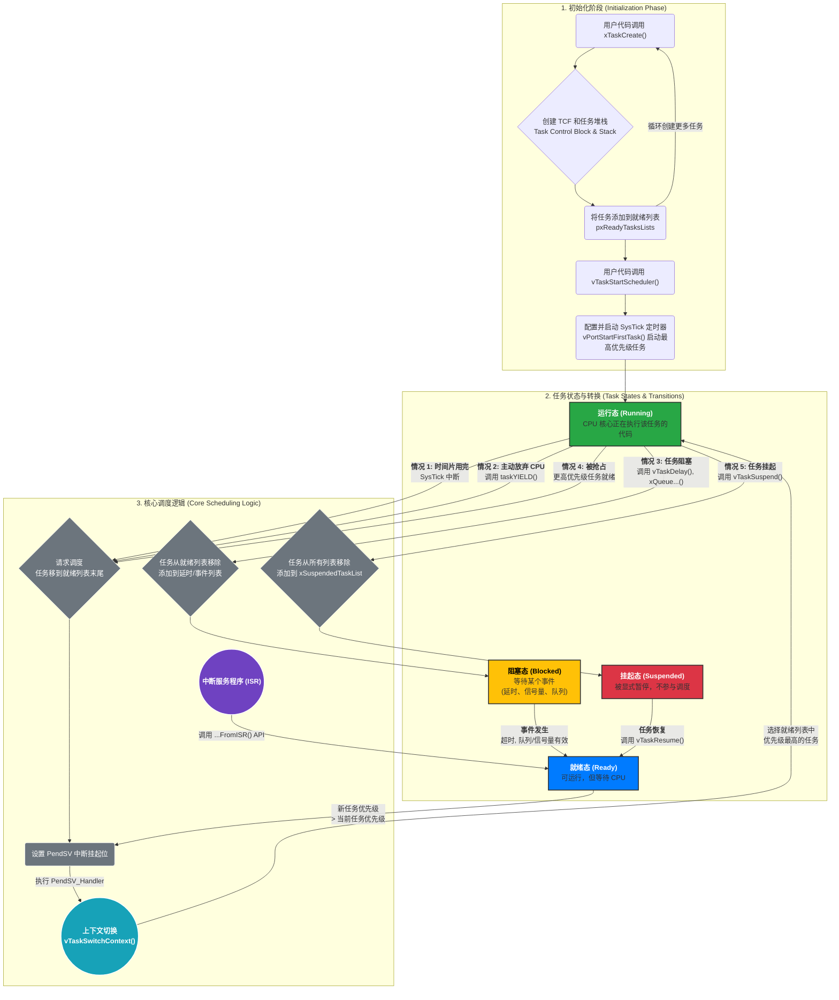
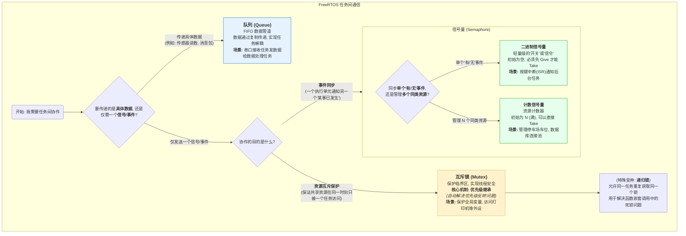

## FreeRTOS系统学习笔记(From Yuannyang Yao)

#### 一、什么是RTOS

> RTOS 是实时操作系统，可以做到多任务调度同时进行，具体是操作系统的知识，目前我还没学过操作系统这本书，后续有时间就看这个教程[B 站视频教程](https://www.bilibili.com/video/BV1RK4y1R7Kf/?spm_id_from=333.337.search-card.all.click&vd_source=0eca01c47c4ad87639d2c7d858e5b3c8)

##### RTOS对比裸机开发的优势

>优势就在于代码量的减少，比如要实现LED0 500ms 亮一次，LED1 1000ms 亮一次，我们在裸机开发时是这样写的
>
>```c
>while(1){
>  uint32_t current_time = HAL_GetTick();//获取当前时间
>  //控制 LED0 500ms 亮一次
>  if(current_time - timestamp_led0 >= 500){
>    GPIOA->ODR ^= (1<<0);
>    timestamp_led0 = current_time; 
>  }
>  //控制 LED1 1000ms 亮一次
>  if(current_time - timestamp_led1 >= 1000){
>    GPIOA->ODR ^= (1<<1);
>    timestamp_led1 = current_time;
>  }
>}
>```
>
>实际上是用两个记号来记录时间点，来做到异步亮灭，这很麻烦，而如果我们用 RTOS 操作系统，我们现在是学习FreeRTOS,怎么写呢？
>
>```c
>#include "FreeRTOS.h"
>#include "task.h"
>
>// 任务句柄声明
>TaskHandle_t led0_task_handle = NULL;
>TaskHandle_t led1_task_handle = NULL;
>
>
>void led0task (void* parameters){
>  while(1){
>    GPIO->ODR ^= (1<<0);
>    vTaskDelay(pdMS_TO_TICKS(500));
>  }
>}
>
>void led1task (void* parameters){
>  while(1){
>    GPIO->ODR ^= (1<<1);
>    vTaskDelay(pdMS_TO_TICKS(1000));
>  }
>}
>
>int main(void) {
>    HAL_Init();
>    SystemClock_Config();
>    MX_GPIO_Init();
>    
>    // 创建LED0任务
>    xTaskCreate(
>        led0task,           // 任务函数
>        "LED0_Task",         // 任务名称
>        128,                 // 任务栈大小（以字为单位）
>        NULL,                // 传递给任务的参数
>        tskIDLE_PRIORITY + 1,// 任务优先级
>        &led0_task_handle    // 任务句柄
>    );
>    
>    // 创建LED1任务
>    xTaskCreate(
>        led1task,           // 任务函数
>        "LED1_Task",         // 任务名称
>        128,                 // 任务栈大小
>        NULL,                // 传递给任务的参数
>        tskIDLE_PRIORITY + 1,// 任务优先级
>        &led1_task_handle    // 任务句柄
>    );
>    
>    // 启动FreeRTOS调度器
>    vTaskStartScheduler();
>    
>
>    while(1) {
>        // Error handling
>    }
>}
>```
>
>
>
>我们发现第二段代码反而更长了，那是因为这个项目我们动了脑子以后想到了好方法，但是用 RTOS，很明显，不用动脑子想设计，而且在更复杂的项目时更加简单易懂，模块化

##### RTOS 是如何实现多任务同时运行的？

>利用时间切片的逻辑，将一条时间线切分成多个时间片，一个 Task 运行一个时间片，并快速切换，且区分 Task 优先级，优先级高的 Task 允许连续使用多个时间片，最多 25 级


#### 二、如何创建STM32 中的FreeRTOS 工程

>我现在急着学 esp32，这一步先跳，以后再学


#### 三、什么是FreeRTOS 的Task

>Task 就是 FreeRTOS 的执行单元，FreeRTOS 在Task 之间反复切换来使用计算资源
>
>每一个 Task 的基本结构都是这样
>```c
>void my_task(void* parameters) {
>    // 初始化代码（只执行一次）
>    
>    // 任务的主循环（一直重复）
>    while(1) {
>        // 做一些工作
>        
>        // 让出CPU给其他任务
>        vTaskDelay(时间);
>    }
>}
>```
>
>Task 的生命周期
>```c
>void led_task(void* parameters) {
>    // 1. 任务创建后，从这里开始执行
>    
>    // 2. 初始化工作
>    配置GPIO();
>    
>    // 3. 进入无限循环
>    while(1) {
>        // 4. 执行任务工作
>        GPIOA->ODR ^= (1<<0);  // 切换LED
>        
>        // 5. 休眠，让其他任务运行
>        vTaskDelay(pdMS_TO_TICKS(500));
>        
>        // 6. 500ms后，任务被唤醒，继续循环
>    }
>    
>    // 7. 正常情况下永远不会到这里
>}
>```
>
>如何创建Task 呢？创建 Task 的基本步骤如下
>```c
>// 1. 声明任务句柄
>TaskHandle_t led_task_handle;
>
>// 2. 创建任务
>xTaskCreate(
>    led_task,              // 任务函数
>    "LED_Task",            // 任务名称（用于调试）
>    128,                   // 栈大小
>    NULL,                  // 传递给任务的参数
>    1,                     // 任务优先级
>    &led_task_handle       // 任务句柄
>);
>
>// 3. 启动调度器
>vTaskStartScheduler();
>```
>
>关于Task 运行逻辑的流程图



#### 四、任务间通信和同步

##### 我们要讨论什么？

>我们下一步要关心的核心是:Task 之间要如何协作，由此，我们引出了两个问题
>
>>1.如何通信，传递数据？
>>2.如何顺序执行，让一个人物在另一个任务结束，拿到参数后才工作？
>
>这就需要了解 FreeRTOS 的概念:队列 **queue**

##### 什么是队列？

>队列就像一个线程安全的**邮箱**。发送方把信（数据）投进去，接收方从里面取信。邮箱自己管理着谁在排队等信，以及信箱满了怎么办。

##### 如何使用队列？

>###### 1.创建队列
>
>>在使用之前，我们必须先创建一个队列对象。这通常在 `main` 函数或系统初始化函数中完成。
>>
>>```c
>>#include "FreeRTOS.h"
>>#include "queue.h"
>>
>>// 定义一个队列句柄 (Handle)
>>QueueHandle_t xNumberQueue;
>>
>>// 在启动调度器前创建它
>>int main(void) {
>>    // 创建一个队列，长度为 5，每个元素是一个 int 的大小
>>    xNumberQueue = xQueueCreate(5, sizeof(int));
>>
>>    // ... 创建任务 ...
>>    // ... 启动调度器 ...
>>}
>>```
>
>###### 2.发送任务
>
>>任务 A 负责生成数据并将其发送到队列中。
>>
>>```c
>>void Task_A_Sender(void* p) {
>>    int number_to_send = 0;
>>    for (;;) {
>>        printf("Sender:  Producing number %d\n", number_to_send);
>>        
>>        // 将数据发送到队列
>>        BaseType_t xStatus = xQueueSend(xNumberQueue, &number_to_send, portMAX_DELAY);
>>
>>        if (xStatus == pdPASS) {
>>            printf("Sender:  Successfully sent %d\n", number_to_send);
>>        } else {
>>            printf("Sender:  Could not send to the queue.\n");
>>        }
>>        
>>        number_to_send++;
>>        vTaskDelay(pdMS_TO_TICKS(1000)); // 每秒发送一次
>>    }
>>}
>>```
>
>##### 3.接受任务
>
>>任务 B 负责从队列中“接收”数据并处理。
>>
>>```c
>>void Task_B_Receiver(void* p) {
>>    int received_number;
>>    for (;;) {
>>        // 从队列接收数据
>>        BaseType_t xStatus = xQueueReceive(xNumberQueue, &received_number, portMAX_DELAY);
>>
>>        if (xStatus == pdPASS) {
>>            printf("Receiver: Got number %d from queue!\n\n", received_number);
>>        }
>>    }
>>}
>>```

##### 什么是信号量？

>信号量的底层就是队列，只是概念上的区别，信号量是用于任务同步的，是标志，而队列给的是信息，换句话说，一个是令牌，一个是信件
>
>信号量主要分为两种：
>
>>1.二进制信号量：令牌只有一个。要么有，要么没有。主要用于 任务同步。
>>
>>2.计数信号量：有一堆令牌。主要用于 资源计数。
>
>对于二进制信号量，其底层机制就是一个长度为 1 的队列，当你创建一个二进制信号量时，FreeRTOS 底层做的事情约等于：
>`xQueueCreate(1, 0);`
>它创建了一个长度为 1、元素大小为 0 的队列。
>长度为 1：代表“令牌”只有一份，要么在队列里（可用），要么不在（不可用）。
>大小为 0：因为我们不关心数据内容，所以不需要为数据分配存储空间，非常节省内存。
>
>`xSemaphoreGive()` (给出信号) ≈ `xQueueSend()` (往队列里放个东西)
>
>`xSemaphoreTake()` (等待信号) ≈ `xQueueReceive()` (从队列里取个东西)
>
>对于计数信号量，其实就是长度不为 1 的队列，这就是个纯概念上的不同，用来管理多个同类资源。
>
>有一个经典的停车场管理例子：一个停车场总共有 10 个车位。多辆车（任务）随时可能到达，想要停车。当车位满了，后来的车必须在入口外排队等待。有车离开时，排在最前面的车可以进入。
>
>首先做初始化
>
>```c
>#include "FreeRTOS.h"
>#include "semphr.h"
>
>// 定义一个信号量句柄
>SemaphoreHandle_t xParkingSpaces;
>
>void main(void) {
>    // 创建一个计数信号量
>    // 最大计数值为 10 (总车位)
>    // 初始计数值为 10 (刚开始所有车位都是空的)
>    xParkingSpaces = xSemaphoreCreateCounting(10, 10);
>
>    // ... 创建多个 CarTask (模拟汽车) ...
>    // ... 启动调度器 ...
>}
>```
>
>然后是汽车任务，每个 `CarTask` 都模拟一辆想要停车的汽车。
>
>```c
>void CarTask(void* p) {
>    char* carName = (char*)p; // 获取汽车的名字
>
>    for (;;) {
>        printf("%s is driving towards the parking lot.\n", carName);
>        vTaskDelay(pdMS_TO_TICKS(uxRandom() % 5000)); // 模拟开车时间
>
>        printf("%s arrived. Checking for available spaces...\n", carName);
>        
>        // 尝试获取一个车位 (Take the semaphore)
>        // 如果没有车位了 (计数值为0)，任务将在此处阻塞等待
>        if (xSemaphoreTake(xParkingSpaces, portMAX_DELAY) == pdTRUE) {
>            // 代码能执行到这里，说明一定成功获取了一个车位
>            printf(">> Great! %s has parked.\n", carName);
>
>            // 模拟停车时间
>            vTaskDelay(pdMS_TO_TICKS(5000 + (uxRandom() % 5000)));
>            
>            printf("<< %s is leaving the parking lot.\n", carName);
>            
>            // 释放车位 (Give the semaphore back)
>            xSemaphoreGive(xParkingSpaces);
>        }
>    }
>}
>```
>
>最后做个表格来总结信号量的知识
>
>| 特性            | 二进制信号量            | 计数信号量                           |
>| --------------- | ----------------------- | ------------------------------------ |
>| **核心用途**    | **事件同步** (A 通知 B) | **资源管理** (N 个资源)              |
>| **底层等价物**  | 长度为 1 的队列         | 长度为 N 的队列                      |
>| **初始状态**    | **空** (必须先 Give)    | **满**或指定值 (可以先 Take)         |
>| **`Give` 行为** | 只能给一个，重复给无效  | 可以连续 `Give` 直到计数值达到最大值 |
>| **`Take` 行为** | 拿走唯一的一个          | 拿走 N 个中的一个                    |
>| **典型场景**    | 中断通知任务            | 停车场、数据库连接池、打印机队列     |

互斥锁

>互斥锁的生命周期:创建 -> 获取 -> 持有（临界区）-> 释放 -> (重复获取...)
>```c
>SemaphoreHandle_t xPrintingMutex;
>
>void main(void) {
>    // 创建一个互斥锁
>    xPrintingMutex = xSemaphoreCreateMutex();
>
>    if (xPrintingMutex != NULL) {
>        // 成功创建！可以继续创建任务了
>    }
>}
>```
>
>它做了什么？ 这会在系统内存中创建一个“钥匙挂钩”对象。这个对象不仅包含了“钥匙是否可用”的状态，还包含了一个非常重要的信息：`pxMutexHolder`，一个指向当前持有该锁的任务（TCB）的指针
>
>初始状态：Mutex 创建后，钥匙是挂在钩子上的，`pxMutexHolder` 指向 `NULL`
>
>获取：`xSemaphoreTake(xMutex, xBlockTime)`这是进入临界区前的“取钥匙”动作
>```c
>if (xSemaphoreTake(xPrintingMutex, portMAX_DELAY) == pdTRUE) {
>    // --- 成功拿到锁，临界区开始 ---
>    
>    // ... 在这里安全地访问打印机 ...
>    
>    // --- 临界区结束 ---
>}
>```
>
>`xSemaphoreTake` 的内部逻辑：
>
>检查钥匙：查看 `pxMutexHolder` 是否为 `NULL`
>
>如果可用 (`NULL`)：
>
>> 将 `pxMutexHolder` 指向**当前任务**的 TCB（记录下“是我拿了钥匙”）
>>
>> 返回 `pdTRUE`
>
>如果不可用 (已被占用)：
>
>> 检查优先级继承：比较当前任务和 `pxMutexHolder` 所指任务的优先级，如果当前任务优先级更高，则临时提升持有者任务的优先级
>>
>> 阻塞等待：根据 `xBlockTime` 参数，将当前任务放入该 Mutex 的等待列表，并进入阻塞态
>
>释放：`xSemaphoreGive(xMutex)`这是离开临界区后的“还钥匙”动作
>```c
>if (xSemaphoreTake(xPrintingMutex, portMAX_DELAY) == pdTRUE) {
>    // ... 临界区 ...
>    
>    xSemaphoreGive(xPrintingMutex); // 必须归还！
>}
>```
>
>`xSemaphoreGive` 的内部逻辑：
>
>> 验证所有权：检查 `pxMutexHolder` 是否指向当前任务。如果不是（比如另一个任务试图释放不属于它的锁），函数会直接返回错误。这是 Mutex 和二进制信号量的核心区别之一
>>
>> 恢复优先级：如果之前因为优先级继承提升了当前任务的优先级，此时将其恢复到原始优先级
>>
>> 释放钥匙：将 `pxMutexHolder` 重新设为 `NULL`
>>
>> 唤醒等待者：检查该 Mutex 的等待列表，如果有任务在等待，则唤醒一个（通常是优先级最高的那个），让它可以去 `Take` 这个锁

##### 递归互斥锁 

> 有时候，代码结构会导致一个任务重复获取同一个锁
>
> 一个复杂的函数 `Func_A` 获取了打印机锁，然后为了复用代码，它调用了另一个函数 `Func_B`，而 `Func_B` 内部也需要获取同一个打印机锁
>
> 使用普通 Mutex：`Func_A` 拿了锁。当它调用 `Func_B`，`Func_B` 再次尝试 `Take` 同一个锁时，它会发现锁已经被“别人”（实际上是自己）拿走了，于是它会自己把自己阻塞掉，形成死锁 (Deadlock)
>
> 解决方案：使用递归锁
>
> ```c
> // 创建一个递归互斥锁
> xPrintingMutex = xSemaphoreCreateRecursiveMutex();
> 
> // 获取/释放递归锁
> xSemaphoreTakeRecursive(xPrintingMutex, portMAX_DELAY);
> xSemaphoreGiveRecursive(xPrintingMutex);
> ```
>
> 工作原理：递归锁内部除了`pxMutexHolder`，还有一个递归计数器 `uxRecursiveCallCount`
>
> 第一次 `TakeRecursive`: 成功获取，计数器置为 1
>
> 后续 `TakeRecursive` (由同一个任务调用): 检查发现 `pxMutexHolder` 就是自己，于是直接成功返回，并将计数器加 1
>
> `GiveRecursive`: 只是将计数器减 1。
>
> 真正释放：只有当计数器从 1 减到 0 时，锁才会被真正释放 (`pxMutexHolder` 被设为 `NULL`)，其他等待的任务才能获取它。




暂时先学这些