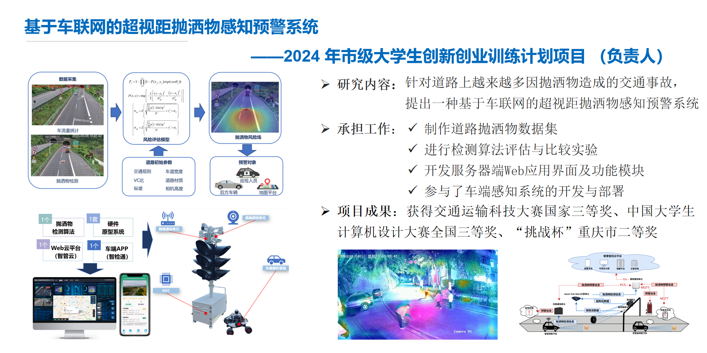
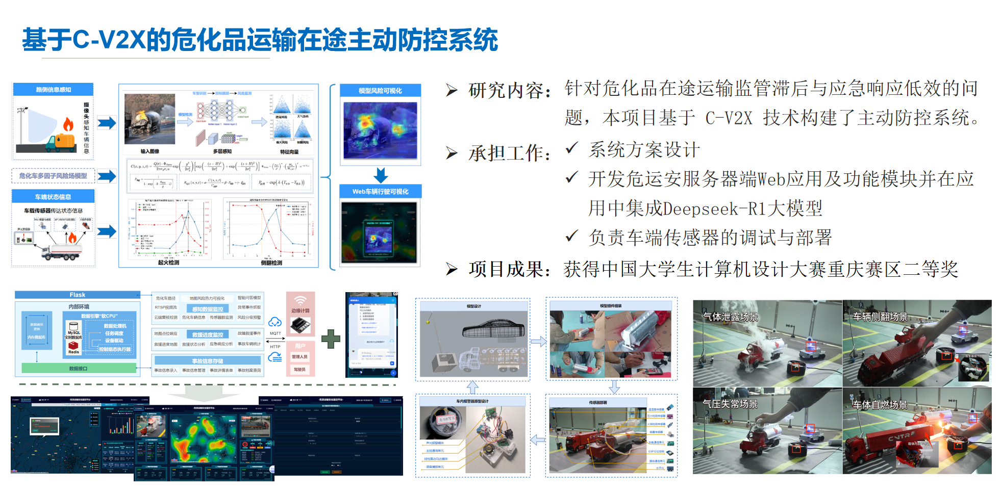

# 欢迎来到我的创意与技术空间 👋

  <!-- 左侧头像 -->
  

    
    
贾文婷

    
👓AI+交通斜杠青年 | 🍎养生行动派 | 🍀自然爱好者 | 📘终身学习者

  

  
  <!-- 右侧轮播相册 -->
  

    

      

        
开发剪影

      

      

        
会议剪影

      

      

        
会议剪影

      

      

        
比赛剪影

      

      

        
比赛剪影

      

      

        
比赛剪影

      

      

        
比赛剪影

      

      

        
实验交流剪影

      

      

        
实验交流剪影

      

      

        
实验交流剪影

      

      

        
实验课剪影

      

    

    

      <button class="gallery-prev">←</button>
      

      <button class="gallery-next">→</button>
    

  

## <strong>Welcome!（你好呀💜）</strong>

    
Hi, my dear friend, welcome to my personal Website! I’m Jia Wenting, and you can call me Jocelyn. Now, I’m a junior undergraduate in Chongqing Jiaotong University.
 
    
见字如面，我亲爱的朋友，欢迎来到我的个人空间站！我是贾文婷，你可以叫我Jocelyn或者小西瓜🍉，我现在是重庆交通大学的一名即将大四的本科生。

## <strong>News（成长记录🔍）</strong>

  

    
<h4 style="font-weight: bolder;">[2023-05-26] <a href="https://news.cqjtu.edu.cn/info/1023/51245.htm">“盛夏•守护”插花获奖作品</a></h4>

  

## <strong>Education（教育经历🎓）</strong>

       
            

                <!-- 本科经历 -->
                

                    <!-- 重庆大学交换学习 -->
                    

                        
<strong>2025.09-2026.06</strong>

                        

                            
重庆大学卓越工程师学院

                            

                                
<i class="fas fa-book-open"></i>📖 专业/方向：智能网联汽车

                                
<i class="fas fa-book-open"></i>📚 主修课程：车载软件开发基础、智能驾驶算法基础、
                                车联网系统与应用、智能网联汽车数据工程、自动驾驶模拟仿真

                            

                        

                    

                    <!-- 重庆交通大学本科 -->
                    

                        
<strong>2022.09-2025.06</strong>

                        

                            
重庆交通大学交通运输学院

                            

                                
<i class="fas fa-book-open"></i> 📖 专业/方向：交通设备与控制工程

                                
<i class="fas fa-user-graduate"></i> 🧑‍🏫导师:何永福

                                
<i class="fas fa-book-open"></i> 📚 主修课程：嵌入式系统、智能网联技术、交通软件工程与实践、
                                交通机电系统、交通大数据分析、交通管理与控制、自动控制原理、电工与电子技术、交通规划原理、交通信息检测及处理技术、
                                交通地理信息系统、单片机原理及应用

                                
<i class="fas fa-book-open"></i>🏆 获得荣誉：国家励志奖学金*2、优秀共青团员、
                                三好学生、科技创新先进个人、心理工作先进个人

                            

                        

                    

                

                <!-- 高中经历 -->
                

                    

                        
<strong>2019.09-2022.06</strong>

                        

                            
重庆市第七中学校

                            

                                
<i class="fas fa-chalkboard-teacher"></i> 🧑‍🏫班主任：罗革雄

                                
<i class="fas fa-book-open"></i> 📚 参与项目计划：重庆市第九期雏鹰计划《太空资源可行性开发》项目成员，实地参观学习西昌卫星发射中心，完成弱重力环境下的岩石破碎实验，参与撰写小论文一篇，成功结题

                            

                        

                    

                

            

## <strong>Parper（发表论文📚）</strong>

《EMSA-Net:An Efficient Multi-Scale and Boundary-Aware Network for Spillage Risk Vehicle Detection Under Low-Light Urban Conditions》
Z. Xu,<strong> W. T. Jia</strong>, C. Y. Yan, R. K. Wang, and Y. F. He, "EMSA-Net:An Efficient Multi-Scale and Boundary-Aware Network for Spillage Risk Vehicle Detection Under Low-Light Urban Conditions" in The 2nd International Conference on Artificial Intelligence of Things and Computing (AITC), Hangzhou, China, 2025. 

## <strong>Projects（项目概况🤖）</strong>

        

            

                
基于车联网的超视距抛洒物感知预警系统

                

                    
                    

                        

                            <strong>技术栈</strong>: Flask + JavaScript + ROS1
                        

                    

                    <a href="/docs/projects/project1.md" class="md-button">查看项目详情</a>
                

            

            

                
基于C-V2X的危化品运输在途主动防控系统

                

                    
                    

                        

                            <strong>技术栈</strong>: Flask + JavaScript + Arduino
                        

                    

                    <a href="/docs/projects/project2.md" class="md-button">查看项目详情</a>
                

            

            

                
智能衣物护理机

                

                    
                    

                        

                            <strong>技术栈</strong>: ESP-IDF + C + VSCode + LVGL
                        

                    

                    <a href="/docs/projects/project3.md" class="md-button">查看项目详情</a>
                

            

        

## **Technical stack (技术栈💻)**

<ul>
<li> 编程语言：Python、C++ </li>    
<li> 人工智能/深度学习：PyTorch、PaddlePaddle </li>
<li> 计算机视觉：OpenCV、YOLO、ultralytics、PaddleDetection、mmDetection </li>
<li> 机器人操作系统：ROS1、ROS2 </li>
<li> 嵌入式开发: Espressif、Jetson Nano </li>
<li> 工具及平台：Linux、Markdown、Docker、Git、GitHub </li>
</ul>

    
    
    
    
    
    
    
    
    
    
    
    
    
    
    
    
    
    
    

## **Hobby（兴趣爱好🎨）**

🍎 养生行动派，目标2025年拿下营养师资格证

🍀 自然爱好者，喜欢各种植物动物，梦想住在乡村有风小院~

📘 终身学习者，喜欢看书，架构自己的人生图书馆~

🍕 爱捣鼓美食也爱吃美食的小小美食家

🎧 耳机一级使用者，爱听歌（KPOP、爵士、R&B）

Sports-喜欢的运动：

<ul>
<li>🏸 乒乓-ping-pong</li>
<li>🚶 散步-walking</li>
<li>🏊‍♀️ 游泳-swimming</li>
<li>🚴 骑行-cycling</li>
<li>🧘‍♀️ 冥想-muse</li>
</ul>

## <strong>Comments（留言📫）</strong>

<section class="cta-section">
✨ 联系我或直接发送邮件至【13640531974@163.com】
</section>

